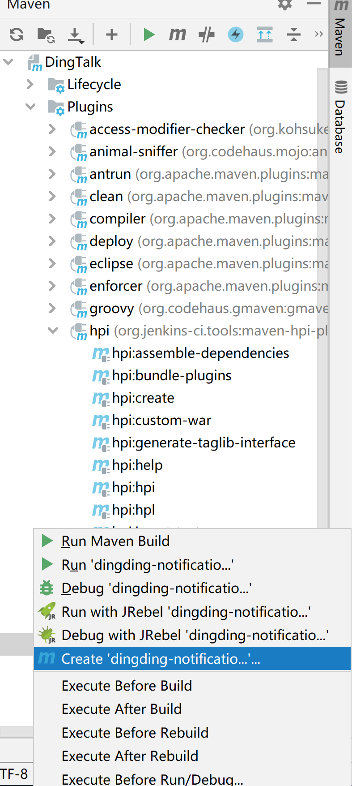

# Contributing

欢迎 PR ~

## 开发服务

命令行启动一个带本插件的本地 Jenkins：

```shell
mvn hpi:run
```

跑测试：

```shell
mvn verify
```

`IDEA` 下也可以在右侧 `maven` 控制面板中把 `hpi:run` 添加到启动配置：


## 开发约定

1. 使用 [Alibaba Java Coding Guidelines](https://plugins.jetbrains.com/plugin/10046-alibaba-java-coding-guidelines/) 校验代码规范
2. 使用 [Google Style Guide](https://github.com/google/styleguide) 统一代码风格
> `IDEA` 下可以下载 [intellij-java-google-style.xml](https://github.com/google/styleguide/blob/gh-pages/intellij-java-google-style.xml)，然后在 `Settings` -> `Editor` -> `Code Style` 进行导入

## 参考文档

1. [Jenkins 插件开发教程](https://www.jenkins.io/doc/developer/tutorial/)
2. [Jenkins 插件开发文档](https://www.jenkins.io/doc/developer/plugin-development/)

---

## 文档服务

文档站用 [VitePress](https://vitepress.dev/) 构建，源文件在 `docs/` 下。

1. 安装 Node.js
2. 在项目根目录执行 `npm ci` 安装依赖
3. 执行 `npm run docs:dev` 启动文档开发环境
4. `npm run docs:build` 构建静态站点，`npm run docs:serve` 预览构建结果

推送到 `main` 后由 GitHub Actions 自动发布，不需要手动执行发布脚本。
