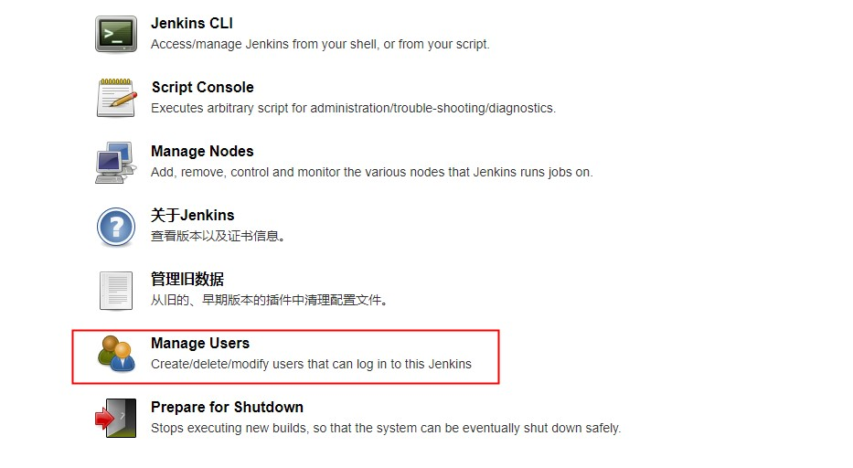
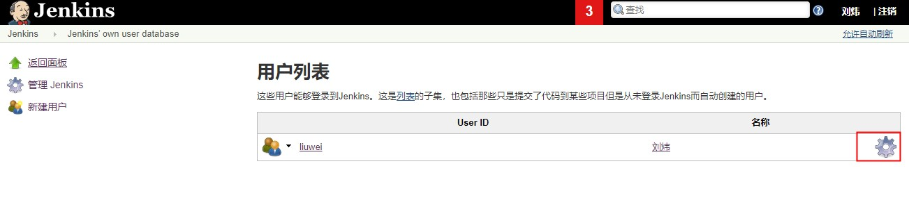
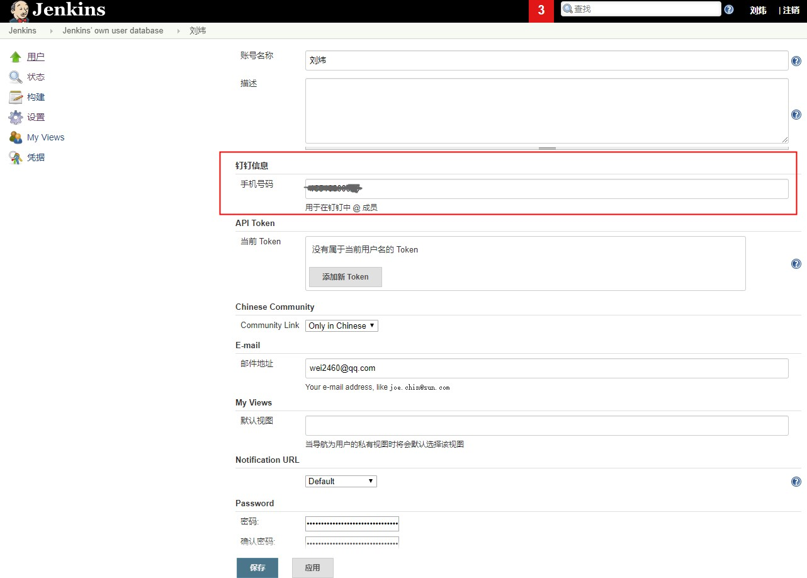

# 用户属性扩展

为了实现 `执行人` 字段带 `@` 效果，需要为 Jenkins 用户补充相关信息

::: warning

内置消息使用 `ACTION_CARD` 类型，钉钉对这类消息的 @ **在手机端不高亮、也不可点击**（通知会正常送达）。
这是钉钉的既有行为，详见 [@ 人](./at-mention.md)。

:::

1. 打开 **Manage Users**

::: details 查看详细

:::

2. 设置用户

::: details 查看详细

:::

3. 添加属性

::: details 查看详细

:::

## 拿不到真实用户的场景

定时构建、webhook 触发这类没有登录用户的构建，这里配的属性用不上。可以改用
`EXECUTOR_NAME` / `EXECUTOR_MOBILE` 环境变量直接指定，见[环境变量](../guide/environment-variables.md)。
