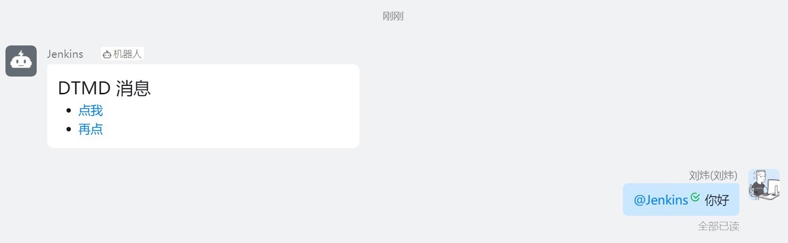

# DTMD 协议的消息

[支持简单的单向交互](https://m.dingtalk.com/qidian/help-detail-1060976699)

::: warning

`dtmd` 协议只能在markdown、actioncard、feedcard 消息类型中使用。

:::

```groovy

pipeline {
    agent any
    stages {
        stage('link'){
            steps {
                echo '测试 MARKDOWN 消息...'
            }
            post {
                success {
                    dingtalk (
                        robot: '3141dbb8-9d32-4344-8324-df6e2b522117',
                        type: 'MARKDOWN',
                        title: '你有新的消息，请注意查收',
                        text: [
                            '# DTMD 消息',
                            '- [点我](dtmd://dingtalkclient/sendMessage?content=你好)',
                            '- [再点](dtmd://dingtalkclient/sendMessage?content=傻逼)'
                        ]
                    )
                }
            }
        }
    }
}

```

:::details 查看结果



:::
