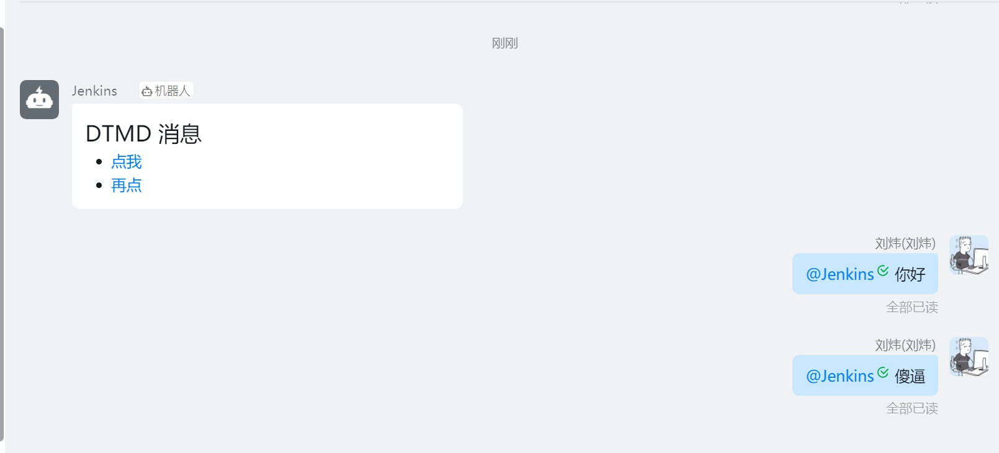

# DTMD 协议的消息

`dtmd` 是钉钉的消息链接协议，用它可以在消息里放一个链接，点击后由用户向机器人发一条消息回去。
钉钉侧关于它的公开资料不多。

::: warning

`dtmd` 协议只能在 markdown、actionCard、feedCard 消息类型中使用，见
[官方文档](https://open.dingtalk.com/document/orgapp/dingtalk-chatbot-for-one-on-one-query)。

:::

```groovy{17,18}

pipeline {
    agent any
    stages {
        stage('link'){
            steps {
                echo '测试 MARKDOWN 消息...'
            }
            post {
                success {
                    dingtalk (
                        robot: '3141dbb8-9d32-4344-8324-df6e2b522117',
                        type: 'MARKDOWN',
                        title: '你有新的消息，请注意查收',
                        text: [
                            '# DTMD 消息',
                            '- [点我](dtmd://dingtalkclient/sendMessage?content=你好)',
                            '- [再点](dtmd://dingtalkclient/sendMessage?content=收到)'
                        ]
                    )
                }
            }
        }
    }
}

```

:::details 查看结果

点击消息里的链接，钉钉会以你的身份向机器人发出对应内容：



:::
