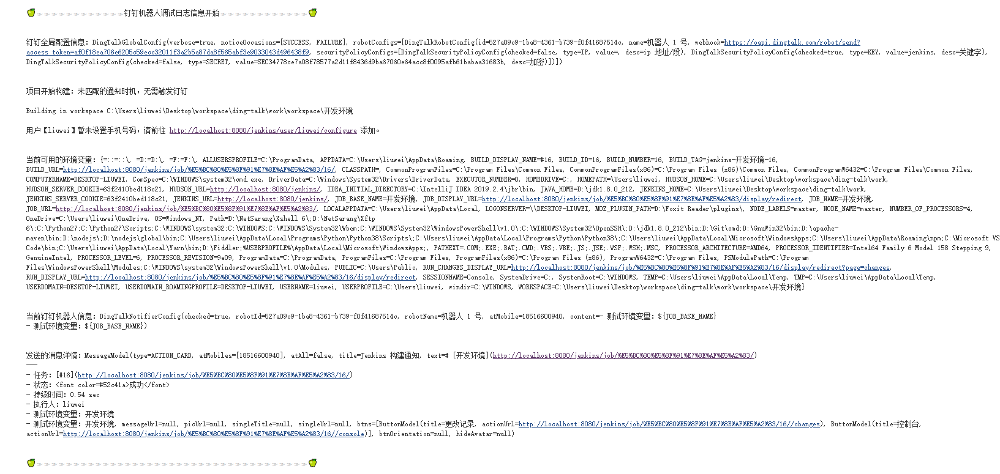
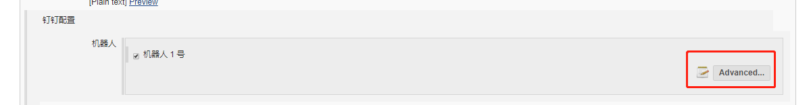
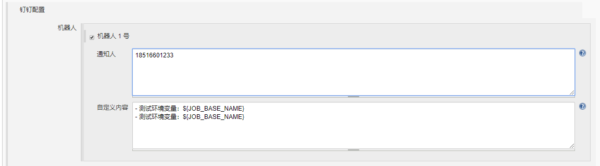

# Freestyle 项目高级功能

## 详细日志

在系统设置中勾选 `详细日志`:

:::details 查看效果

:::

## 高级功能

在项目配置中勾选机器人之后，点击 `advanced` 按钮：

:::details 查看效果

:::

::: tip

`通知人` 多个值需要换行添加

`自定义内容` 支持 markdown 语法与环境变量，基本与 pipeline 模式保持一致

:::
