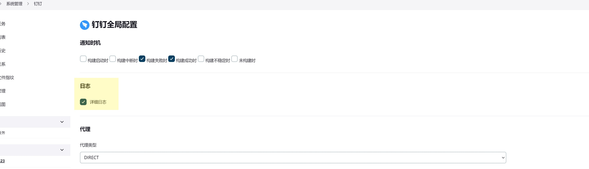
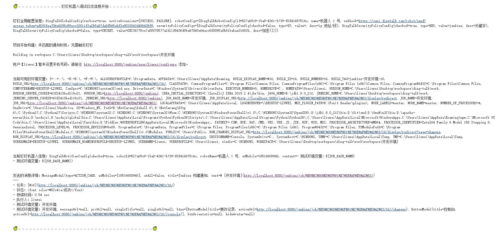
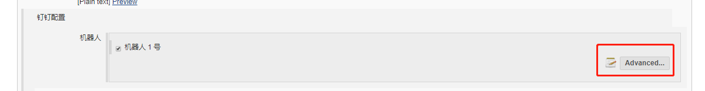
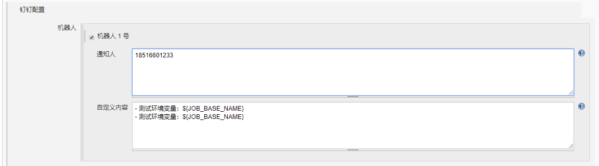
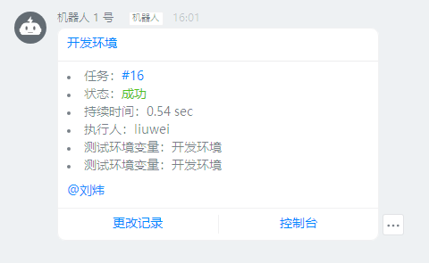

# Freestyle 项目高级功能

## 详细日志

在系统设置中勾选 `详细日志`:

:::details 查看效果

:::

## 高级功能

在项目配置中勾选机器人之后，点击 `advanced` 按钮：

:::details 查看效果

:::

::: tip

`通知人` 可以填多个手机号，换行或英文逗号分隔都行，也支持写 `${EXECUTOR_MOBILE}` 这样的环境变量。

`自定义内容` 支持[受限的 markdown 语法](../advance/markdown.md)与[环境变量](../guide/environment-variables.md)。

勾上 `禁用内置消息` 就不再发插件封装好的那条消息，只发 `自定义消息` 里写的内容，
两者的区别见[自定义消息](../advance/custom-message.md)。

:::

::: warning

`PROJECT_NAME`、`JOB_STATUS` 这类由插件补充的环境变量只在这里生效，pipeline 的 `dingtalk`
步骤里取不到，别照搬。

:::
