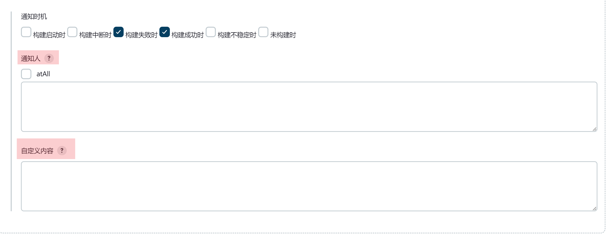

# 环境变量

插件在发送内置通知前，会往构建的环境变量里补充下面这些变量，可以直接在 `自定义内容`、`自定义消息`
和 `通知人` 里用 `${变量名}` 引用。构建自身的环境变量（`BUILD_NUMBER`、`GIT_COMMIT` 等）同样可以用。

## 环境变量列表

| 变量              | 说明                                          |
|-----------------|---------------------------------------------|
| EXECUTOR_NAME   | 构建人姓名                                       |
| EXECUTOR_MOBILE | 构建人手机号，会被添加到 `@` 列表                         |
| PROJECT_NAME    | 项目名称，包含文件夹层级，例如 `folder » my-job`           |
| PROJECT_URL     | 项目地址                                        |
| JOB_NAME        | **本次构建**的名称，默认是 `#42` 这样的构建号                |
| JOB_URL         | **本次构建**的地址                                 |
| JOB_DURATION    | 构建耗时，例如 `1 min 20 sec`                      |
| JOB_STATUS      | 本次通知对应的构建状态：开始 / 成功 / 失败 / 取消 / 不稳定 / 未构建   |

::: warning

注意 `PROJECT_` 和 `JOB_` 的分工和字面意思不太一样：`PROJECT_*` 指的是**项目**，`JOB_*` 指的是**本次构建**。

:::

::: tip

`PROJECT_URL` 与 `JOB_URL` 依赖系统设置里的 Jenkins URL。没配的话构建日志里会提示
`Please set jenkins Root URL in [ System Configuration >> System >> Jenkins Location >> Jenkins URL ]`，
并且 `JOB_URL` 会是空字符串、`PROJECT_URL` 退化成不带域名的相对路径。

:::

## 覆盖构建人信息

`EXECUTOR_NAME` 与 `EXECUTOR_MOBILE` 是**可以被覆盖的**：插件先看构建环境里有没有同名变量，
有就用你给的值，没有才去取触发构建的 Jenkins 用户信息。

所以定时构建、webhook 触发这类拿不到真实用户的场景，可以自己把人塞进去：

```groovy
pipeline {
    agent any
    environment {
        EXECUTOR_NAME = '张三'
        EXECUTOR_MOBILE = '13800138000'
    }
    stages {
        stage('build') {
            steps {
                echo '构建人信息会带到通知里'
            }
        }
    }
}
```

::: warning

pipeline 里 `environment` 的值是随构建执行逐步收集的，所以这种覆盖只对**构建结束**时的那条通知生效，
`构建启动时` 那条仍然用 Jenkins 用户信息。想让两条都生效，改用构建参数或全局环境变量。

:::

正常情况下应该走 [用户属性扩展](../advance/user-property.md)，由 Jenkins 用户自己维护手机号。

## 生效范围

::: warning

上面这些变量**只对内置通知和项目级配置生效**，在 pipeline 的 `dingtalk` 步骤里取不到。

:::

`dingtalk` 步骤拿到的是构建自身的环境变量，插件补充的这 8 个变量是发送内置通知时才写进去的。
在步骤里想要类似的内容，用 Jenkins 自带的变量或 Groovy 表达式自己拼，例如
`currentBuild.result`、`currentBuild.durationString`、`env.BUILD_URL`。

步骤的这些参数支持环境变量展开：`robot`、`title`、`text`、`messageUrl`、`picUrl`、
`singleTitle`、`singleUrl`、`at`，以及 `btns` 里每一项的 `title` 和 `actionUrl`。

## 支持自定义环境变量的内容



`通知人` 也支持环境变量，而且一行可以写多个手机号——换行和英文逗号都能用来分隔：

```
${EXECUTOR_MOBILE}
13800138000,13900139000
```
