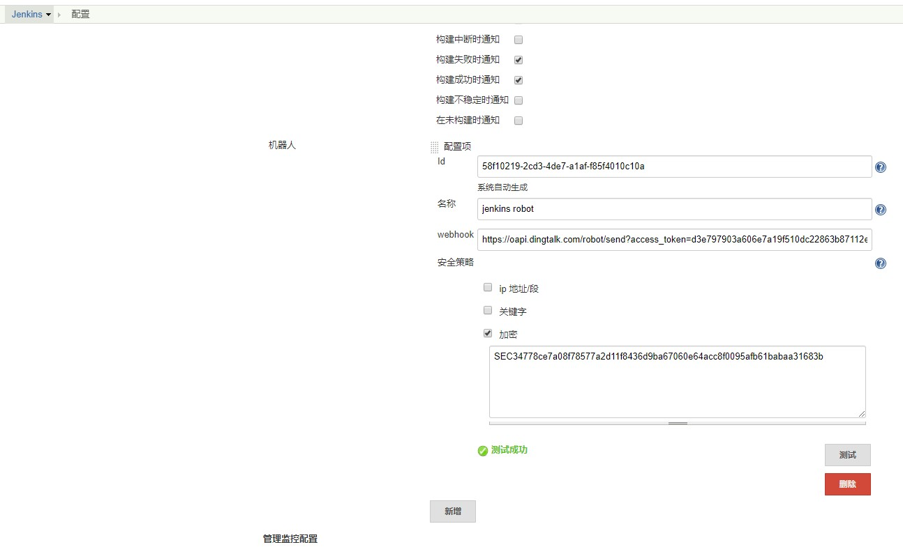
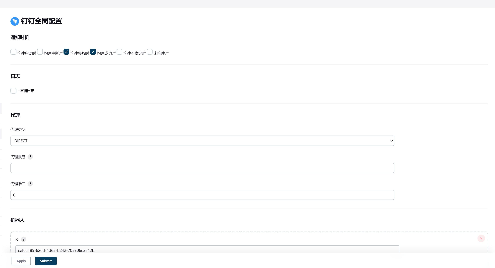

# 快速开始

::: warning

请确保你的 Jenkins 版本 >= 2.176.4

**本文档只针对最新版插件，请务必升级插件**

:::

## 注意

如果 jenkins 更新中心地址（升级站点）不是官方的，可能无法获取最新的版本（第三方镜像有延迟）

请切回官方镜像源：https://updates.jenkins.io/update-center.json 

## 安装插件

在 `Manage Plugins` 安装 [DingTalk](https://plugins.jenkins.io/dingtalk/)

## 机器人配置

在 `Configure System` 中找到 `钉钉配置` 选项卡，根据自己的需求选择 `通知时机`，然后添加机器人即可

示例截图：
::: details

:::

::: tip

推荐使用 `加密` 模式的安全策略，并测试配置是否正确

:::
