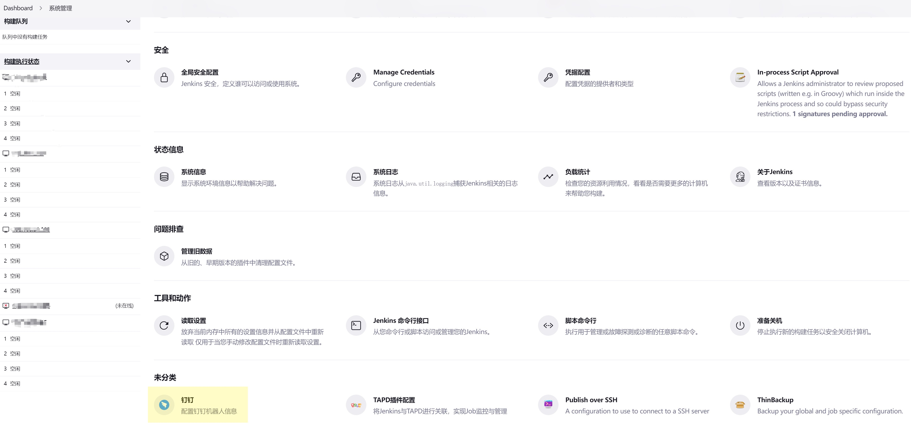
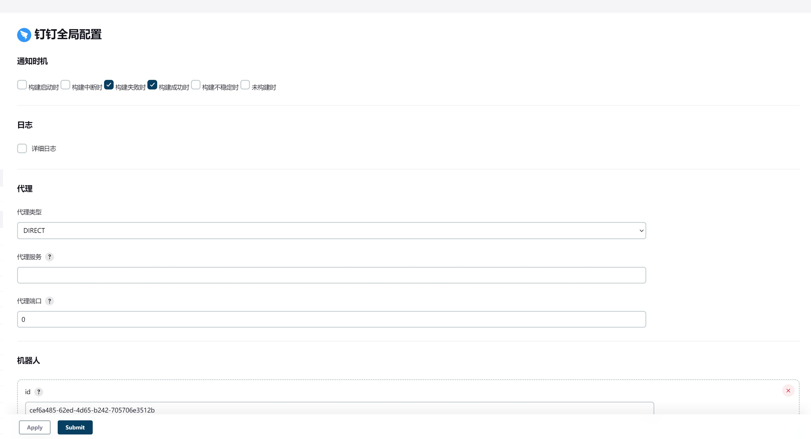

# 快速开始

::: warning

请确保你的 Jenkins 版本 >= 2.479.3

**本文档只针对最新版插件，请务必升级插件**

:::

## 注意

如果 jenkins 更新中心地址（升级站点）不是官方的，可能无法获取最新的版本（第三方镜像有延迟）

请切回官方镜像源：<https://updates.jenkins.io/update-center.json>

## 安装插件

在 `Manage Plugins` 安装 [DingTalk](https://plugins.jenkins.io/dingding-notifications)

## 机器人配置

在 `Configure System` 中找到 `钉钉配置` 选项卡，根据自己的需求选择 `通知时机`，然后添加机器人即可

示例截图：
::: details

:::

::: tip

推荐使用 `加签` 模式的安全策略，并测试配置是否正确

:::

## 通知时机

`通知时机` 决定哪些构建结果会触发通知，可以在系统设置里设默认值，也可以在每个项目里单独勾选。

| 选项      | 触发条件                                            |
|---------|-------------------------------------------------|
| 构建启动时   | 构建开始时立即发送，与最终结果无关                                |
| 构建成功时   | 构建结果为 `SUCCESS`                                 |
| 构建恢复正常时 | 构建结果为 `SUCCESS`，而上一次是 `FAILURE` 或 `UNSTABLE`    |
| 构建失败时   | 构建结果为 `FAILURE`                                 |
| 构建中断时   | 构建结果为 `ABORTED`，例如被人手动停止                        |
| 构建不稳定时  | 构建结果为 `UNSTABLE`，通常是测试失败但构建本身没报错                |
| 未构建时    | 构建结果为 `NOT_BUILT`，例如 pipeline 阶段被跳过             |

一次构建最多产生两条通知：`构建启动时` 一条，结束时按结果再匹配一条。都不勾选就不会发送任何内容。
`构建恢复正常时` 往前找上一次有结果的构建，中间被取消、未构建的不算。恢复正常的那次构建，勾了它的机器人收到的是恢复正常的通知，只勾了 `构建成功时` 的照常收到成功通知，不会两条都发。

## 安全策略

钉钉侧有三种安全方式，但**只有前两种需要在 Jenkins 里填东西**：

| 钉钉侧的安全方式 | Jenkins 侧要不要填  | 说明                              |
|----------|---------------|---------------------------------|
| 自定义关键词   | 要，填 `自定义关键词`  | 多个关键词用逗号隔开                      |
| 加签       | 要，填 `加签密钥`    | 推荐这种，填钉钉给的 `SEC` 开头的密钥即可        |
| IP 白名单   | **不用填**       | 把 Jenkins 的出口 IP 配到钉钉机器人里就行     |

::: tip

用关键词模式时不需要自己在消息内容里写关键词——插件会把这里配的关键词自动拼到消息上
（`TEXT` 类型拼在正文末尾，其余类型拼在标题末尾）。代价是关键词会出现在收到的消息里，
而且填了多个的话是整串一起拼上去的，所以关键词建议只填一个、且选一个不影响阅读的词。

:::

## 机器人类型与 Webhook

钉钉机器人分为 **企业内部机器人** 与 **自定义机器人** 两种：

- **自定义机器人**：在钉钉群内创建后会生成 Webhook 地址。可在钉钉侧选择安全方式（关键词/加签/IP 白名单）。
  - [关键词文档](https://open.dingtalk.com/document/dingstart/customize-robot-security-settings#title-jk6-ksi-zur)
  - [加签文档](https://open.dingtalk.com/document/dingstart/customize-robot-security-settings#title-7fs-kgs-36x)
  - [IP 白名单文档](https://open.dingtalk.com/document/dingstart/customize-robot-security-settings#title-hvj-mm1-5xu)
- **企业内部机器人**：获取 Webhook 的方式不同，请参考[官方 FAQ](https://open.dingtalk.com/document/development/faq-robot#ba79fa80c4c0g)

只有 **自定义机器人** 才有关键词和加签这两种安全方式，也就是说上面那张表只对自定义机器人有意义；
用 **企业内部机器人** 时，Jenkins 侧的安全策略留空即可。

## 接下来

- [在 freestyle 项目中使用](./freestyle.md)
- [在 pipeline 中使用](./pipeline.md)
- [让通知 @ 到人](../advance/at-mention.md)
- [完全自定义消息内容](../advance/custom-message.md)
