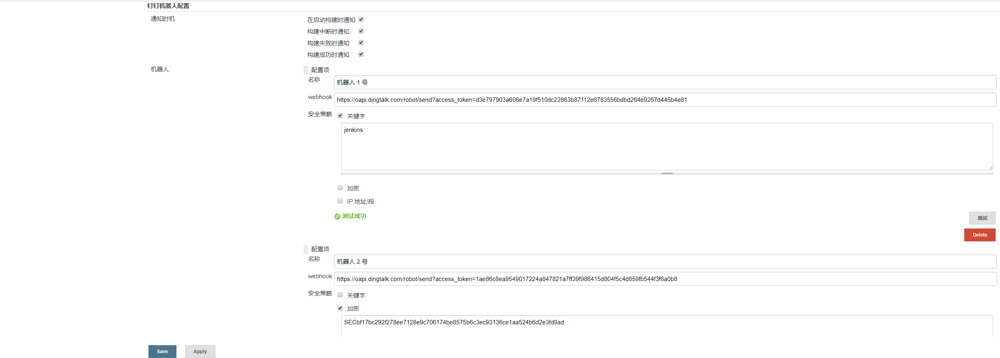
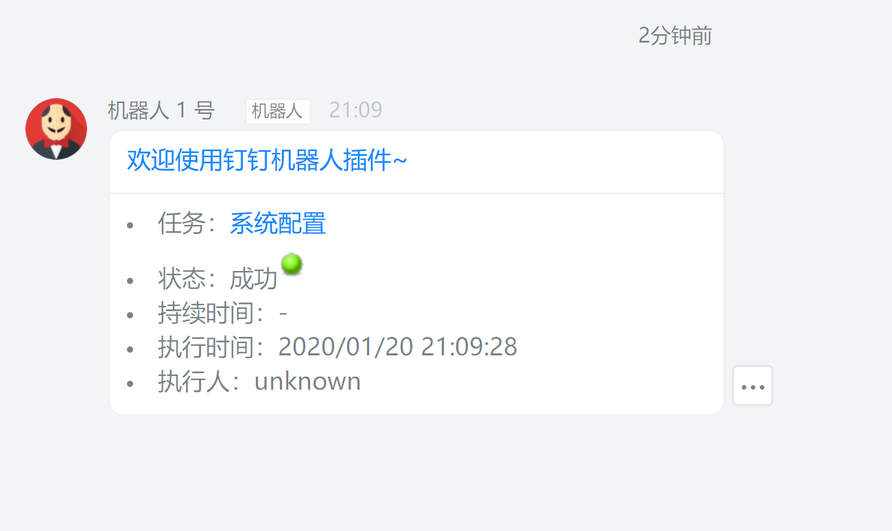
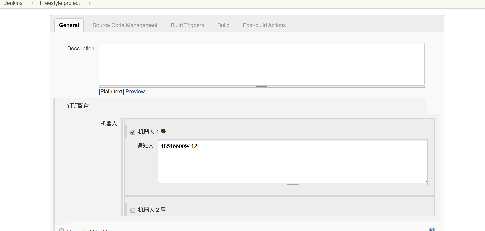
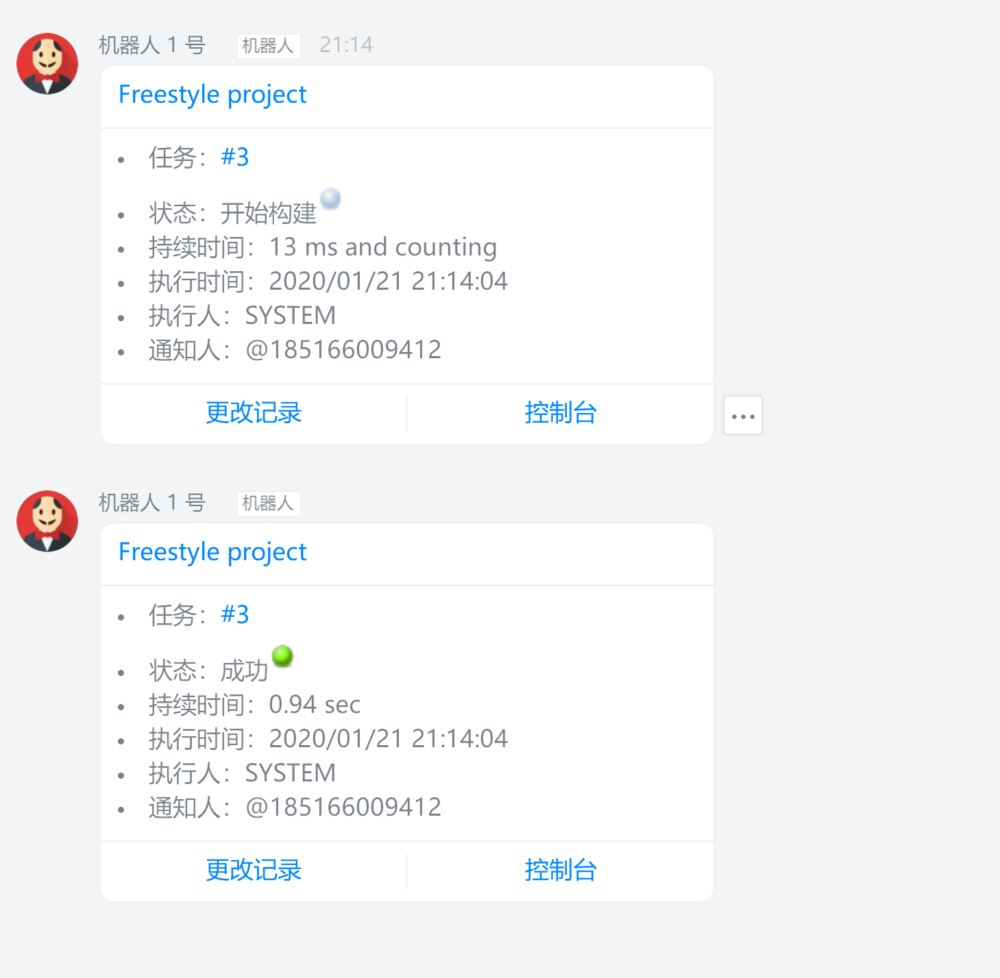

# DingTalk 机器人通知

## 使用

1. 在 `系统管理` > `系统设置` > `钉钉配置` 中添加机器人

> 经测试，钉钉机器人的安全策略配置的选项属于`与` 关系，即如果勾选了多个策略，则需要同时满足。
所以，插件的配置最好与钉钉机器人上保持一致。

2. 在项目配置页面中勾选机器人

## 特性
理论上支持所有类型的项目，并且不需要特别的设置。

## TODO
1. 扩展钉钉消息类型
2. 支持脚本调用