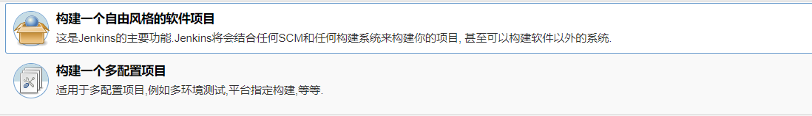
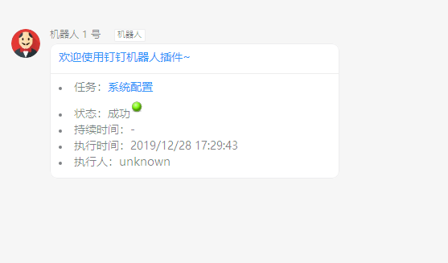
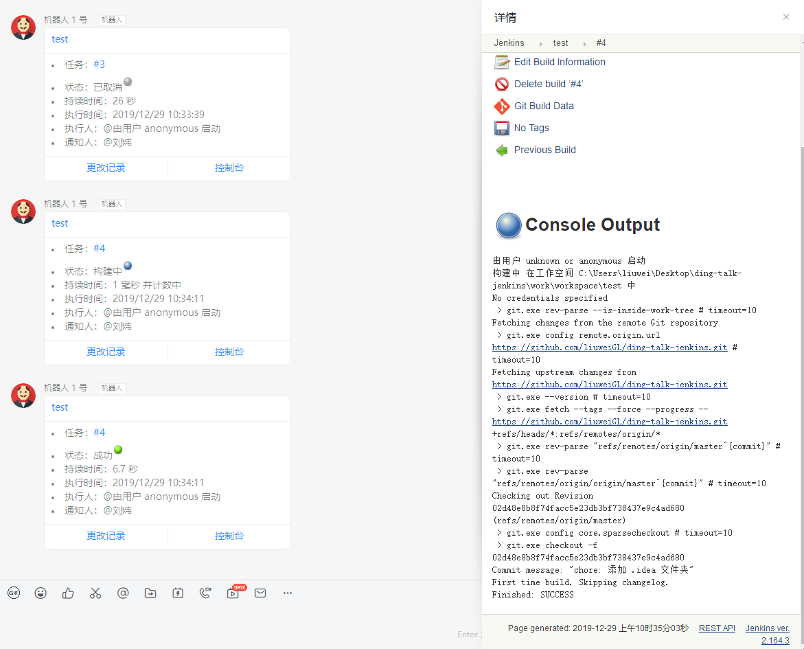
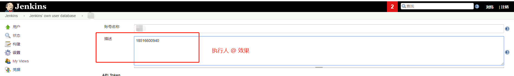

# DingTalk 机器人通知

## 支持的项目

## 使用

1. 在 `系统管理` > `系统设置` > `钉钉机通知配置` 中选择 **通知时机** 并添加机器人信息。
2. 在任务配置中选择需要触发的机器人，并可以填写每个机器人需要 `@` 的人（填写手机号码，以换行分割）。

### 截图

## 注意

1. 如果 `执行人` 字段需要 `@` 效果，请在 `Manage Jenkins` > `Manage Users` 在每个用户设置页面的描述中添加手机号。

---

2. 经测试，钉钉机器人的安全策略配置的选项属于`与` 关系，即如果勾选了多个策略，则需要同时满足。所以，插件的配置最好与钉钉机器人上保持一致。

## TODO

插件开发的一些总结
